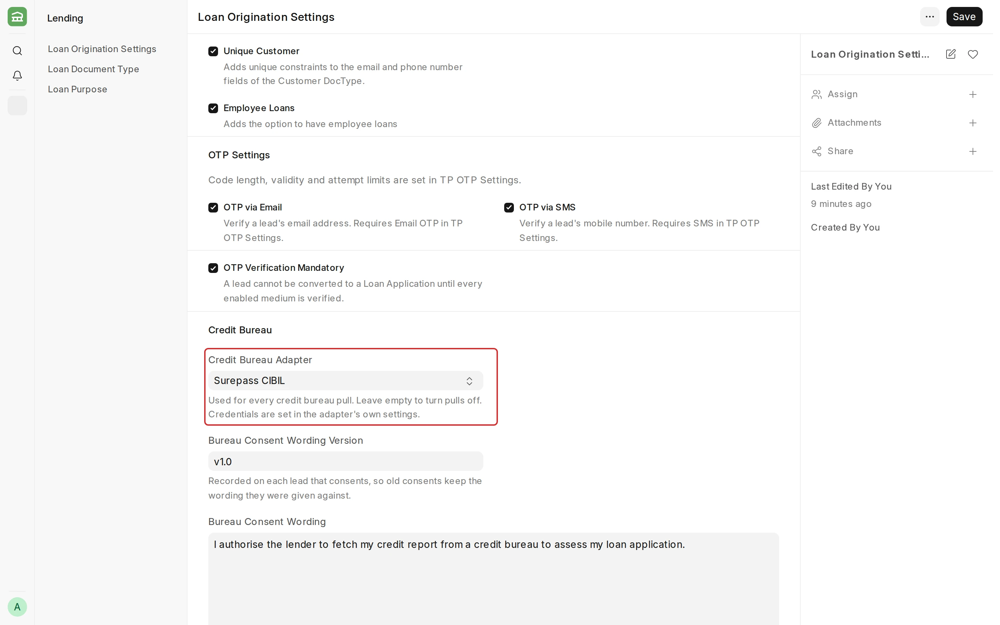
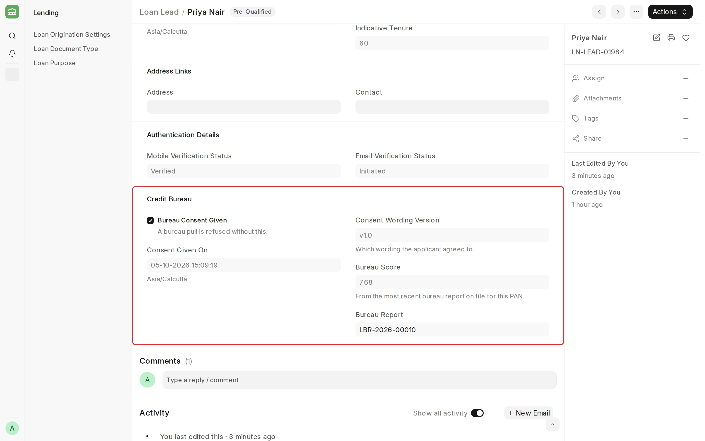
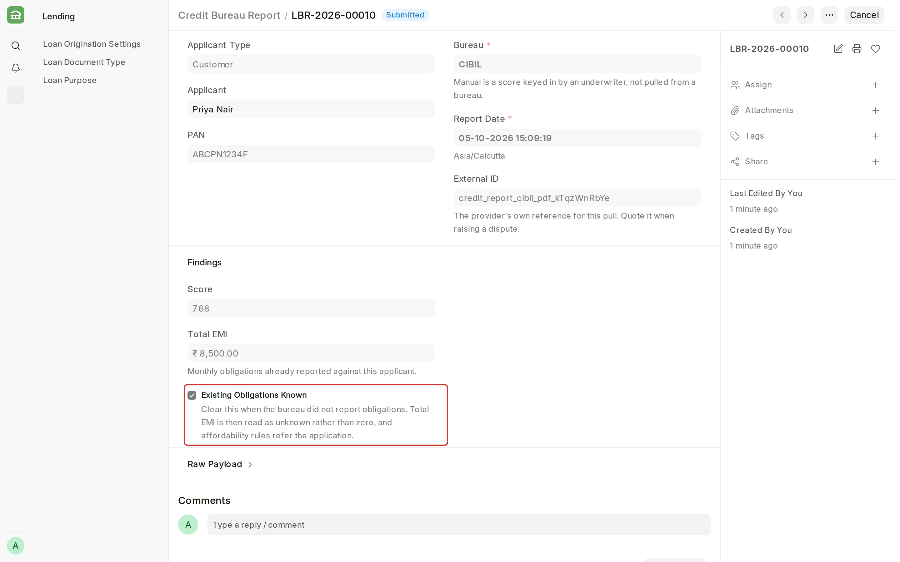

## Credit Bureau

**Credit Bureau pulls a bureau report for the applicant during the [Loan Lead](/lending/loan-lead) workflow, and gives the bureau score to the [credit decisioning](/lending/credit-decisioning) rules.**

Lending does not talk to any bureau itself. A bureau is added by the eKYC_India app, through an adapter that holds the bureau's credentials. See [Integrations](/lending/e-signing).

:::caution
Every pull is billed, and it leaves an enquiry on the applicant's credit file that cannot be removed.
:::

#### Prerequisites

Before pulling a credit bureau report, it is mandatory to have:

- The **eKYC India** app installed, with your Surepass token in **Surepass Settings**.
- The **Loan Lead Workflow** activated. See [Workflow](/erpnext/workflows).
- The applicant's **PAN** on the Loan Lead.

#### Step 1: Choose the adapter

To access Loan Origination Settings, go to:

> **Home > Lending > LOS > Loan Origination Settings**

In the **Credit Bureau** section, select the **Credit Bureau Adapter**, enter the **Bureau Consent Wording** and its **Version**, and save.

#### Step 2: Record consent on the Loan Lead

Check **Bureau Consent Given** on the Loan Lead and save, before the lead is **Qualified** or **Rejected**. A pull is refused without consent.

#### Step 3: Run the pull

Select **Run Pre-Qualification Rules** on the lead. Lending saves the result as a **Credit Bureau Report**, and the lead shows its **Bureau Score**.

Lending pulls only once for each Loan Lead and each Loan Application. To turn pulls off, disable the **Pull Credit Bureau Report** task in [Workflow Transition Tasks](/erpnext/workflow-transition-tasks).

#### When a pull fails

| Message | What to do |
| --- | --- |
| Consent Required | Record consent on the Loan Lead, then run the transition again. |
| Set a Credit Bureau Adapter | Select an adapter, or disable the pull task. |
| Bureau Pull Failed | Fix the cause shown in the Integration Request, then pull again. |
| Bureau Report Not Stored | The bureau answered, so the enquiry is already billed and recorded. Do not mark the Integration Request as **Failed**: Lending then pulls again, which adds a second charge and a second enquiry. Get the report from the bureau with the **Request ID** on the Integration Request, and ask your system administrator to reconcile the request. |
| Call Already In Flight | If the Integration Request is **Authorized**, the bureau answered: do the steps for **Bureau Report Not Stored**. If it is **Queued**, Lending does not know if the bureau answered. Ask the bureau if it has an enquiry for this request. Only if it has none, ask your system administrator to mark the request as **Failed**, then pull again. |

:::caution
Lending keeps **every** Integration Request on the site for ten years instead of 90 days. To change this, add a row for Integration Request in Log Settings.
:::

#### Related topics

- [Integrations](/lending/e-signing)
- [Credit Decisioning](/lending/credit-decisioning)
- [Loan Lead](/lending/loan-lead)
- [Workflow Transition Tasks](/erpnext/workflow-transition-tasks)
