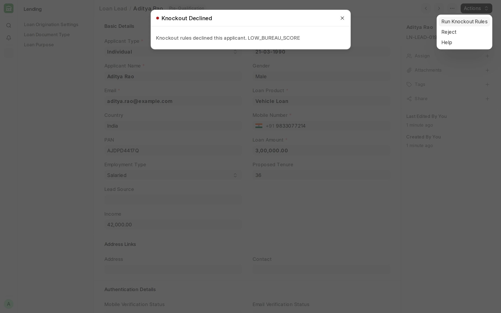
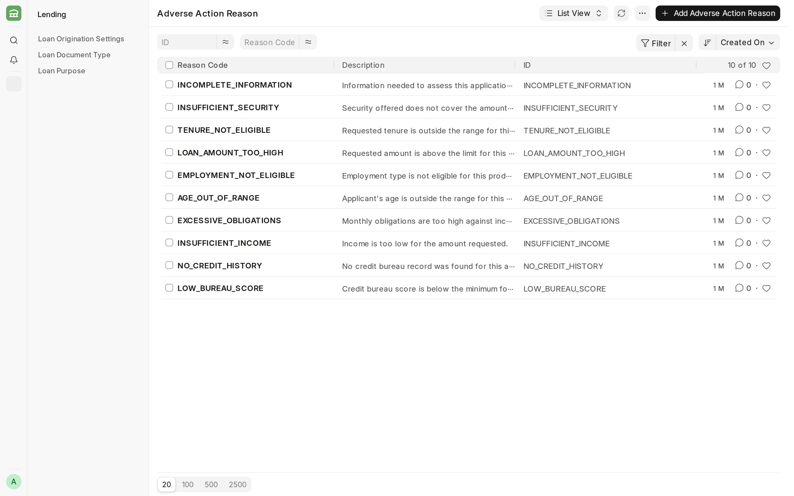

## Credit Decisioning

**Credit Decisioning checks each applicant against rules that you write, and returns Approve, Decline, or Refer.**

#### Prerequisites

Before setting up credit decisioning, it is advised to have:

- A [Loan Product](/lending/loan-product) for each product you want to decide.
- The **Loan Lead Workflow** activated. See [Workflow](/erpnext/workflows).
- [Credit Bureau](/lending/credit-bureau) set up, if your rules read the bureau score.

#### What you set up

- [Decision Strategy](/lending/decision-strategy): an ordered list of rules for one stage.
- [Scorecard](/lending/scorecard): points for each value band, and a grade for each total. Used at underwriting only.
- [Adverse Action Reasons](#adverse-action-reasons): the reason codes a Decline rule cites.

#### Stages

| Stage | Where it runs | What it does |
| --- | --- | --- |
| Pre-Qualification | **Run Pre-Qualification Rules** on the Loan Lead | Records a status and indicative terms in the lead's **Pre-Qualification** section. It never stops the lead. |
| Knockout | **Run Knockout Rules** on the Loan Lead | Stops the lead when a rule returns Decline. |
| Underwriting | A [Loan Decision](/lending/loan-decision) on the Loan Application | Scores the application and recommends terms. |

The knockout stage also stops the lead when a Decline rule cannot be checked because its value is missing. The message lists the reason codes. Nothing is saved on the lead.

:::note
Pre-qualification runs before the bureau report is pulled. On a lead's first pass, only the knockout rules see the new report.
:::

#### Variables

A rule or a scorecard band reads one of these values.
| Variable | Source |
| --- | --- |
| `loan_amount`, `tenure`, `loan_product`, `applicant_type` | The Loan Lead or the Loan Application |
| `monthly_income`, `age`, `employment_type` | The Loan Lead |
| `bureau_score`, `existing_obligations` | The latest submitted Credit Bureau Report |
| `dti_ratio` | Existing obligations divided by monthly income |
| `rate_of_interest`, `proposed_emi`, `ltv_ratio`, `foir_ratio` | The Loan Application only |

Write ratios as fractions, for example `0.5` for 50%.

:::caution
A missing value is never treated as zero. A rule on a missing value is skipped, and an Approve after a skipped rule becomes **Refer**. At the knockout stage, a skipped Decline rule stops the lead, so a Knockout Decline rule on an application-only variable stops every lead.
:::

#### Adverse Action Reasons

A reason code tells the applicant why a rule declined them. Every Decline rule must cite one. Lending installs ten codes by default, such as `LOW_BUREAU_SCORE`, `INSUFFICIENT_INCOME` and `AGE_OUT_OF_RANGE`. Additional codes can be created as required.

#### Permissions

- **System Manager** and **Loan Manager** have full access.
- **Loan Underwriter** can read strategies and scorecards, and create and submit Loan Decisions.
- **Loan Officer** runs the workflow transitions, but needs write permission on Loan Lead and read permission on Credit Bureau Report. Lending does not grant these by default.

#### Related topics

- [Decision Strategy](/lending/decision-strategy)
- [Scorecard](/lending/scorecard)
- [Loan Decision](/lending/loan-decision)
- [Credit Bureau](/lending/credit-bureau)
- [Loan Lead](/lending/loan-lead)
