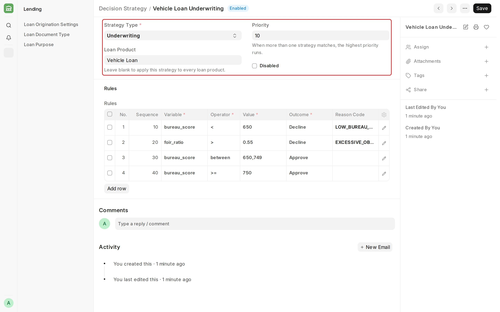
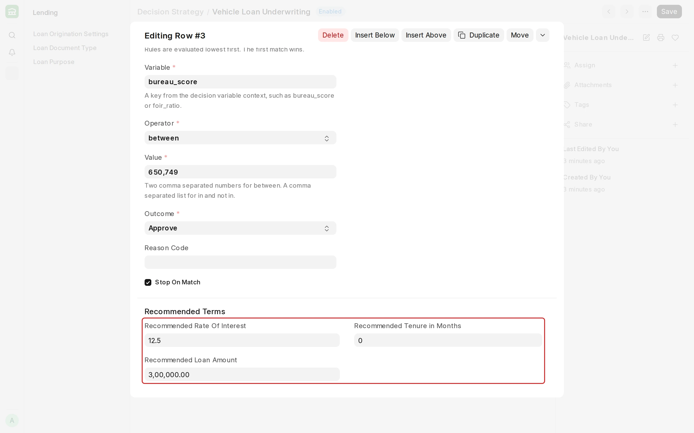

## Decision Strategy

**A Decision Strategy is an ordered list of rules for one [credit decisioning](/lending/credit-decisioning) stage. Each rule tests one variable and returns Approve, Decline, or Refer.**

#### Prerequisites

Before creating a Decision Strategy, it is advised to have:

- A [Loan Product](/lending/loan-product), if the strategy is for one product only.
- The System Manager or Loan Manager role.

#### How to create a Decision Strategy

1. Go to the Decision Strategy list and click **Add Decision Strategy**.
2. Enter a **Strategy Name** and select the **Strategy Type**.
3. Optionally, select a **Loan Product** and set a **Priority**.
4. Add one row for each rule in the **Rules** table.
5. Save.

**Pre-Qualification** and **Knockout** strategies run on the Loan Lead. **Underwriting** strategies run on a [Loan Decision](/lending/loan-decision).

#### Which strategy runs

Lending runs one strategy for each stage. A strategy for the applicant's loan product always wins over a strategy with no product. Among those, the highest **Priority** runs.

<!-- :::tip
To try out a new strategy, give it a lower priority than the live one and check it with [Test Run](/lending/loan-decision#test-run) on a Loan Decision.
::: -->

#### Rules

| Field | What it means |
| --- | --- |
| Sequence | Rules run lowest first. |
| Variable | The value the rule tests. See [Variables](/lending/credit-decisioning#variables). |
| Operator, Value | How the variable is compared, and with what. |
| Outcome | **Approve**, **Decline**, or **Refer**. |
| Reason Code | The [Adverse Action Reason](/lending/credit-decisioning#adverse-action-reasons) given to the applicant. Mandatory for Decline. |
| Stop On Match | Stops the run when this rule matches. On by default. |

| Operator | Value | Example |
| --- | --- | --- |
| `>`, `>=`, `<`, `<=` | One number | `bureau_score` `<` `650` |
| `==`, `!=` | One number or one word | `employment_type` `==` `Salaried` |
| `in`, `not in` | A comma-separated list | `employment_type` `in` `Salaried,Self-employed` |
| `between` | Two comma-separated numbers, both included | `bureau_score` `between` `650,749` |

Numbers are written without separators (`100000`), and ratios as fractions (`0.55` for 55%).

##### Recommended terms

A rule that does not decline can recommend a rate, a loan amount and a tenure. At pre-qualification, these become the lead's indicative terms. At underwriting, they are copied to the Loan Application.

#### Example

The **Vehicle Loan Underwriting** strategy above has four rules:

| Sequence | Rule | Outcome | Terms |
| --- | --- | --- | --- |
| 10 | `bureau_score` `<` `650` | Decline, `LOW_BUREAU_SCORE` | |
| 20 | `foir_ratio` `>` `0.55` | Decline, `EXCESSIVE_OBLIGATIONS` | |
| 30 | `bureau_score` `between` `650,749` | Approve | 12.5%, at most ₹3,00,000 |
| 40 | `bureau_score` `>=` `750` | Approve | 10.5% |

:::note
A rule on a missing value is skipped. If any rule is skipped, an Approve becomes **Refer**.
:::

