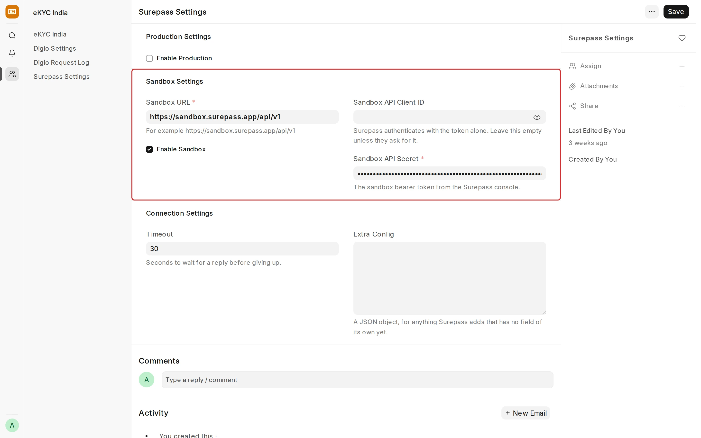

## Surepass Integration

[Surepass](https://surepass.io/) is an Indian API platform that fetches credit reports from the credit bureaus. The eKYC India app uses it to pull credit reports for Frappe Lending from four bureaus:

| Bureau | Credit Bureau Adapter |
| --- | --- |
| CIBIL | Surepass CIBIL |
| CRIF High Mark | Surepass CRIF |
| Equifax | Surepass Equifax |
| Experian | Surepass Experian |

> The bureau adapters need Frappe Lending on the same site.

---

### Setup

- Go to **Surepass Settings** in the Frappe Desk to configure the integration.

**Environment — Sandbox / Production**

Surepass provides two environments. Use **Sandbox** for testing and **Production** for live pulls. Only one can be active at a time. If both are enabled, Production is used.

For each environment, fill in the URL and the API Secret (the bearer token from the Surepass console). Leave the API Client ID empty.

> Sandbox access must be requested directly from the Surepass team.

**Connection Settings**

- Timeout: How many seconds to wait for Surepass to answer. The default is 30.

**Choose the bureau in Lending**

In **Loan Origination Settings**, select one of the Surepass adapters in **Credit Bureau Adapter**. Only one bureau is active at a time. For consent and the pull task, see [Credit Bureau](/lending/credit-bureau).

---

### How a pull works

- A Loan Officer selects **Run Pre-Qualification Rules** on a Loan Lead
- Frappe sends the applicant's name, PAN, mobile number and gender to Surepass
- Surepass returns the bureau score, its reference ID and the bureau's PDF
- Lending saves them as a Credit Bureau Report

> Surepass does not return the applicant's monthly obligations, so rules on `existing_obligations`, `dti_ratio` and `foir_ratio` refer the application. To use these rules, enter **Total EMI** on a manual Credit Bureau Report.

---

### Things to note

- **PAN is required.** Surepass refuses a pull without a PAN, and the enquiry must then be settled. See [When a pull fails](/lending/credit-bureau#when-a-pull-fails).
- **Soft or hard enquiry** is decided by your Surepass account. Confirm with Surepass before you pull at the lead stage.
- **Rate limits and cost** are set by your Surepass plan. A rate-limited pull is logged as failed, and can be repeated later.

---

### Integration Request

Every pull is logged in **Integration Request**, with the adapter as the service. Personal identifiers are removed from the log.
