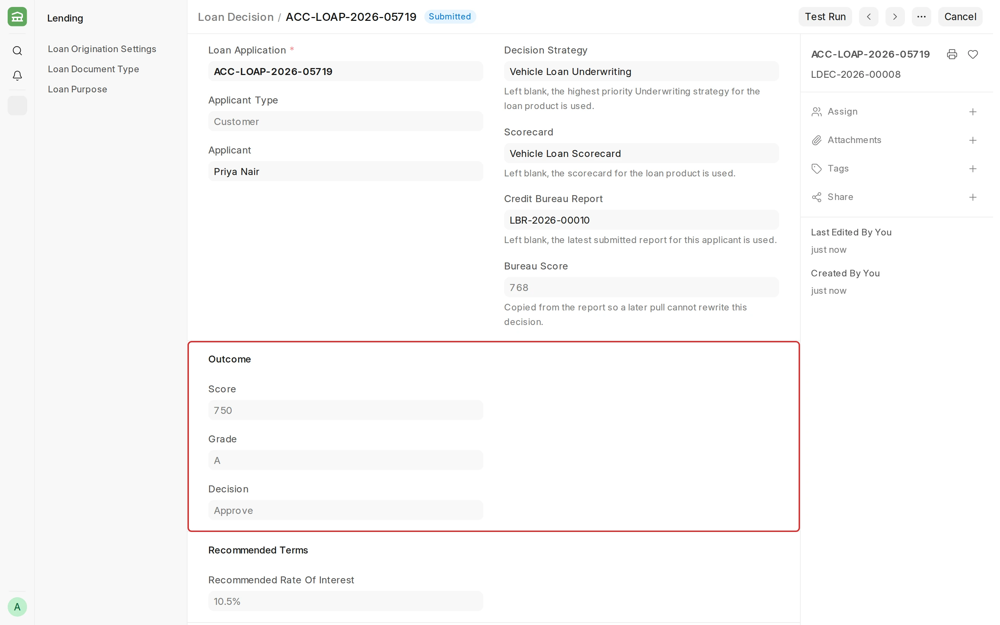
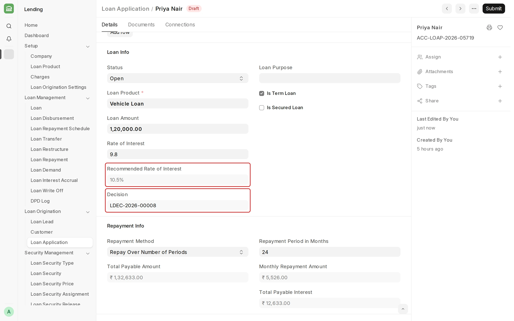
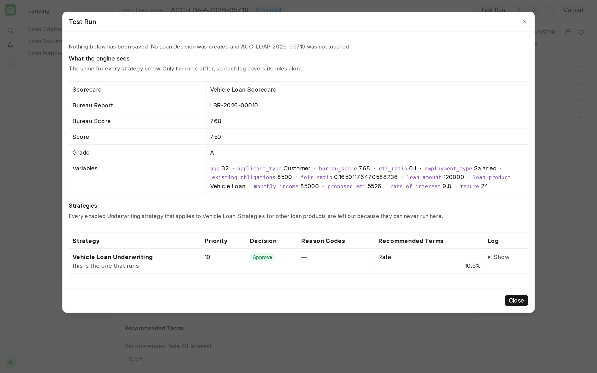

## Loan Decision

**A Loan Decision records the underwriting result for a [Loan Application](/lending/loan-application). It runs the Underwriting [Decision Strategy](/lending/decision-strategy) and the [Scorecard](/lending/scorecard) for the loan product.**

#### Prerequisites

Before creating a Loan Decision, it is advised to have:

- A draft Loan Application.
- An enabled Underwriting Decision Strategy for the loan product.
- The Loan Underwriter, Loan Manager, or System Manager role.

#### How to create a Loan Decision

1. Go to the Loan Decision list and click **Add Loan Decision**.
2. Select the **Loan Application**. Leave **Decision Strategy**, **Scorecard**, and **Credit Bureau Report** blank to let Lending choose them.
3. Save. Lending fills in the **Score**, **Grade**, **Decision**, **Reason Codes**, and recommended terms.
4. Submit.

On submit, the decision and the recommended terms are copied to the Loan Application.

<!-- #### Test Run

**Test Run** shows what every Underwriting strategy for the loan product would decide, without saving anything. Use it to compare a new strategy with the live one.

 -->

#### Things to note

- Recommended terms are not applied to the application automatically.
- If the application changes after saving, save the decision again before submitting.
- A new Loan Decision replaces the earlier one on submit.
- **Audit Trail** shows how the decision was reached.

:::caution
A Decline decision does not stop the Loan Application from being approved. Lending records the decision but does not enforce it.
:::

