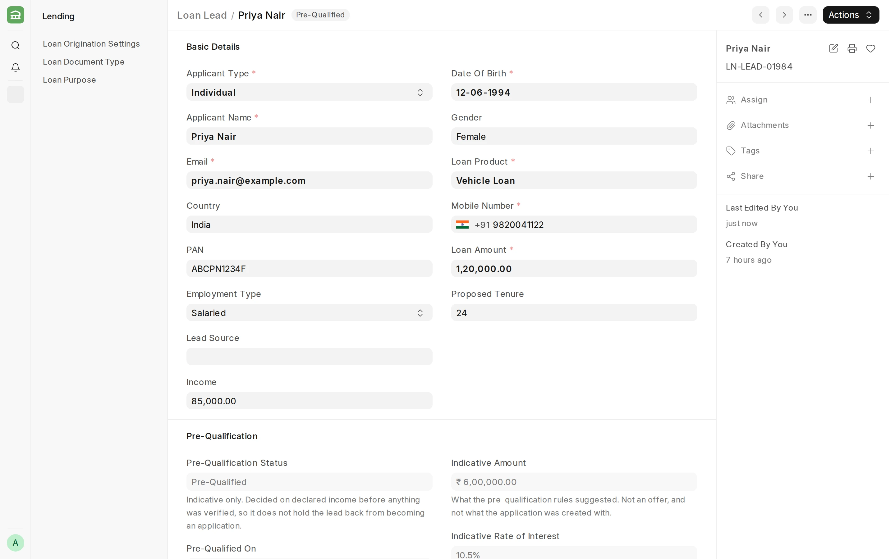
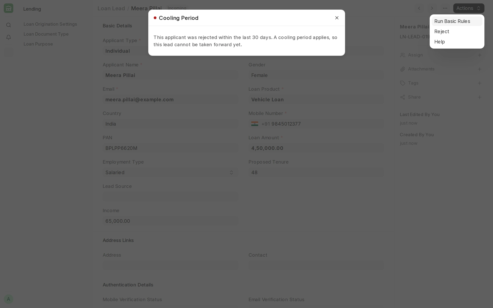
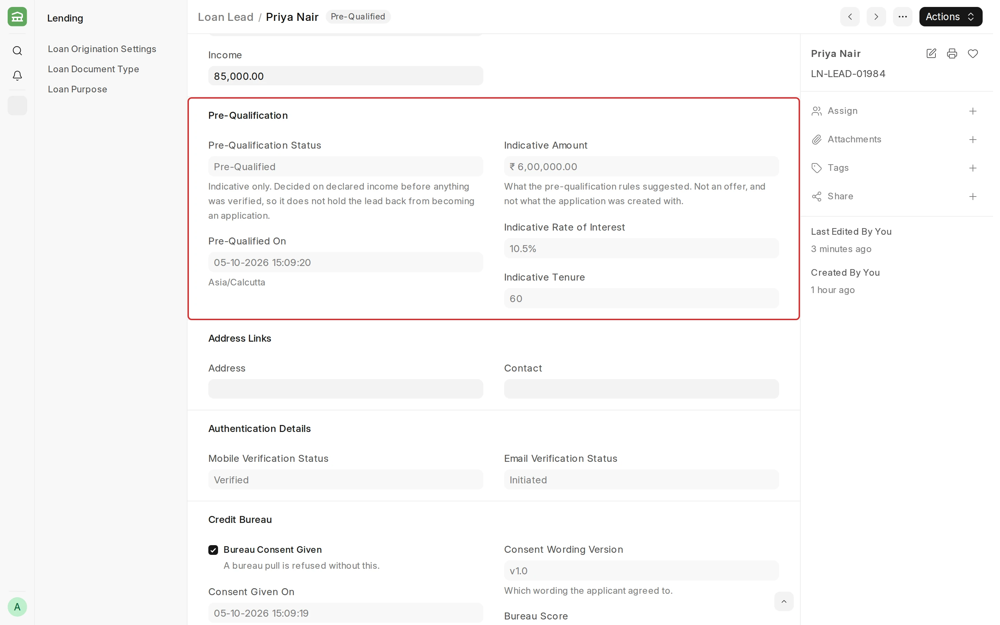
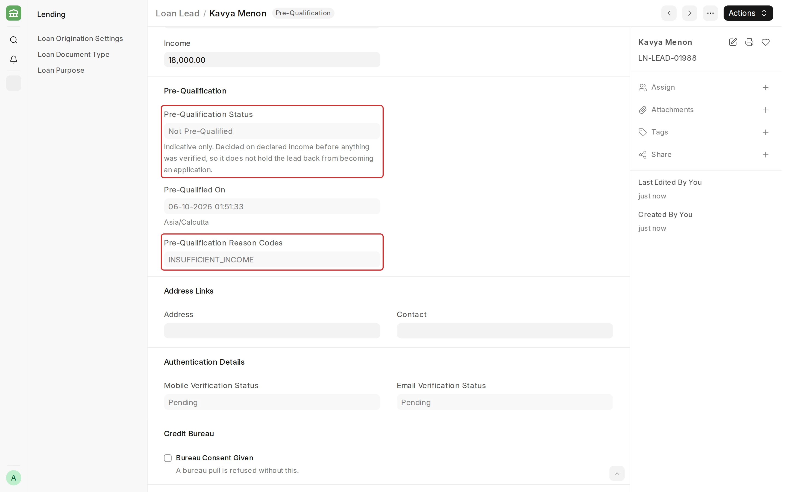

## Loan Lead

A **Loan Lead** is the first-stage borrower enquiry record used before creating a formal loan application. It captures basic applicant profile, contact details, requested loan amount, product preference, and proposed tenure. This helps teams qualify incoming opportunities and prepare them for application processing.

To access Loan Lead, go to:

> **Home > Lending > Loan Origination > Loan Lead**

#### Prerequisites

Before creating a Loan Lead, it is advised to have:

- [Loan Product](/lending/loan-product) master
- Basic applicant contact details
- Loan Lead Workflow activated

#### How to create a Loan Lead

1. Go to Loan Lead List and click on Add Loan Lead.
2. Select Applicant Type.
3. Enter Applicant Name, Email, Mobile Number, Loan Product, and Loan Amount.
4. Enter Proposed Tenure and other profile details as required.
5. Save and Submit.

#### Individual vs business details

- For **Individual** applicants, Date of Birth is captured and age is derived.
- For **Business** applicants, Company Name can be captured.
- For applicants in India, PAN can be captured. The lead rules and the credit bureau pull use it to identify the applicant.

<!-- #### Lead rules

When you select **Run Basic Rules**, three rules check the applicant. If a rule fails, the lead stays in **Incoming** and the reason is shown.

| Rule | What it checks |
| --- | --- |
| Age | Individual applicants must be 18 years or older. |
| Cooling period | An applicant rejected in the last 30 days cannot be taken forward. |
| Live loan limit | An applicant who already holds the maximum number of live loans cannot be taken forward. This rule is off by default. |

The cooling period is counted from **Rejected On**, which is set when the lead is rejected. To use a different number of days for a product, set **Cooling Period in Days** on the Loan Product.

Both the cooling period and the live loan limit identify the applicant by PAN. If the lead has no PAN, Email and Mobile Number are used.

To turn off a rule, open **Loan Lead Basic Rules** in [Workflow Transition Tasks](/erpnext/workflow-transition-tasks) and uncheck **Enabled** on its row. -->

#### Contact and verification readiness

Loan Lead includes contact references and verification status placeholders (mobile/email verification tracking) so teams can manage lead readiness in a structured way.

The applicant's email and mobile number can be verified with an OTP. See [OTP Verification](/lending/otp-verification).

#### Pre-Qualification details

When you select **Run Pre-Qualification Rules**, the lead is checked against the Pre-Qualification [Decision Strategy](/lending/decision-strategy) for its loan product. The result is recorded in the **Pre-Qualification** section. All fields in this section are read only.

| Field | Description |
| --- | --- |
| Pre-Qualification Status | **Pre-Qualified** if the rules approve the applicant, **Referred** if they need a manual review, and **Not Pre-Qualified** if they decline the applicant. Blank if no rule matched. |
| Pre-Qualified On | The date and time the rules were run. |
| Pre-Qualification Reason Codes | The reasons the rules gave, for example `INSUFFICIENT_INCOME`. |
| Indicative Amount, Indicative Rate of Interest, Indicative Tenure | The loan terms the rules suggest for this applicant. |

When the rules decline or refer an applicant, the reason is recorded in **Pre-Qualification Reason Codes**. In the example below, the applicant's income of ₹18,000 is below the product's minimum, so the lead is **Not Pre-Qualified** with the reason code `INSUFFICIENT_INCOME`.

Pre-qualification uses only the details the applicant declares, such as **Income**. Nothing is verified at this stage, so the indicative figures are not an offer to the applicant.

> Pre-qualification records a result. It does not stop the lead. A lead that is **Not Pre-Qualified** can still move forward and be converted to a Loan Application.

:::note
If no Pre-Qualification strategy applies to the lead's loan product, no rules are run and the **Pre-Qualification** section stays empty. A comment on the lead says that no strategy applied. To set up a strategy, see [Decision Strategy](/lending/decision-strategy).
:::

#### Credit bureau consent

Check **Bureau Consent Given** in the **Credit Bureau** section before the lead moves to Pre-Qualification. A credit bureau report is not pulled without it. See [Credit Bureau](/lending/credit-bureau).

#### Convert to Loan Application

After the lead is qualified, it can be used to start a [Loan Application](/lending/loan-application) with key details prefilled (applicant contact info, loan product, amount, and tenure).

The Loan Application uses the Loan Amount and Proposed Tenure from the lead, not the indicative figures. If **OTP Verification Mandatory** is enabled, the lead converts only after every enabled medium (email, mobile, or both) is verified.
