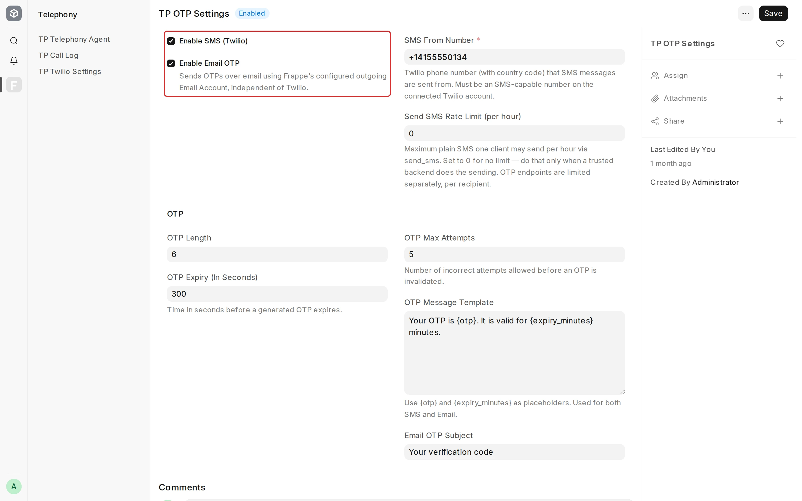
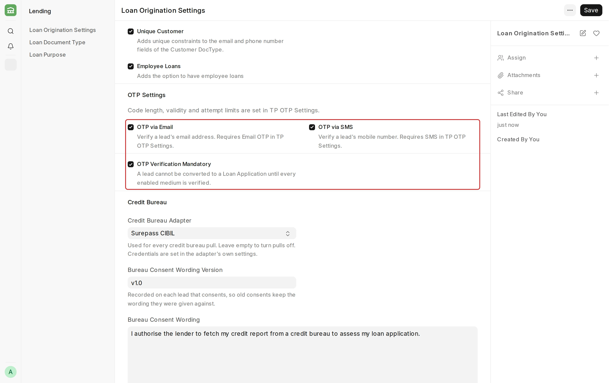
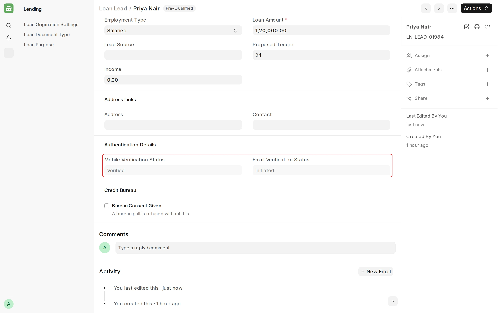
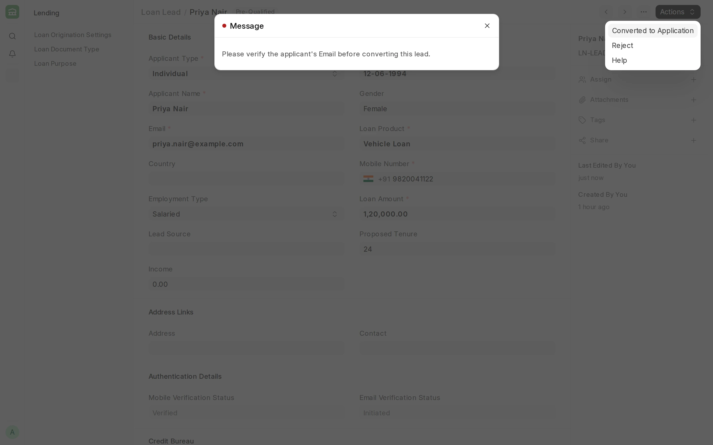

## OTP Verification

**OTP Verification confirms that the mobile number and email address on a [Loan Lead](/lending/loan-lead) belong to the applicant.**

On the [Borrower Portal](/lending/borrower-portals), the applicant enters an OTP sent to their mobile number before the lead is created. The new lead's **Mobile Verification Status** reads **Verified**. For leads that come from your own application form or integration, send and verify the OTP through the [OTP Verification API](/lending/loan-management/api-documentation/otp-verification).

Frappe Lending uses the [Telephony](https://github.com/frappe/telephony) app to generate, send and check each OTP.

#### Prerequisites

Before setting up OTP Verification, it is advised to have:

- The [Telephony](https://github.com/frappe/telephony) app installed on your site.
- For SMS: a Twilio account with an SMS-capable phone number, entered in **TP Twilio Settings**.
- For email: a default outgoing [Email Account](/erpnext/email-account).

#### Step 1: Set up TP OTP Settings

1. Open **TP OTP Settings**.
2. Check **Enable SMS (Twilio)**, **Enable Email OTP**, or both.
3. For SMS, enter the **SMS From Number** with its country code.
4. Save.

| Field | What it means |
| --- | --- |
| OTP Length | The number of digits in each OTP. The default is 6. |
| OTP Expiry (In Seconds) | The time after which an OTP stops working. The default is 300, which is 5 minutes. |
| OTP Max Attempts | The number of incorrect entries allowed before the OTP stops working. The default is 5. |
| OTP Message Template | The text of the SMS and the email. It must contain `{otp}`. |

#### Step 2: Turn on OTP in Loan Origination Settings

To access Loan Origination Settings, go to:

> **Home > Lending > LOS > Loan Origination Settings**

1. In the **OTP Settings** section, check **OTP via Email**, **OTP via SMS**, or both.
2. Optionally, check **OTP Verification Mandatory**.
3. Save.

You can check a medium only when its channel is on in TP OTP Settings.

:::caution
If you later turn a channel off in TP OTP Settings, also clear the medium here. Otherwise every OTP for that medium fails.
:::

#### Verification status on the Loan Lead

The **Authentication Details** section of the Loan Lead shows **Mobile Verification Status** and **Email Verification Status**.

| Status | Meaning |
| --- | --- |
| Pending | No OTP has been sent yet. |
| Initiated | An OTP was sent, and it is not verified yet. |
| Verified | The applicant entered the correct OTP. |

Both fields are read only. If you change the **Email** or the **Mobile Number**, the status of that field goes back to **Pending**.

#### Make verification mandatory

When **OTP Verification Mandatory** is checked, a lead cannot be converted to a [Loan Application](/lending/loan-application) until every medium checked in Loan Origination Settings reads **Verified**.

#### Things to note

- Only the latest OTP works. A new OTP replaces the earlier one.
- After **OTP Max Attempts** incorrect entries, the applicant must wait for the OTP to expire before asking for a new one.
- The **Mobile Number** must include the country code, for example `+91 98200 41122`.
- If an SMS does not arrive, open **TP SMS Log** to see why Twilio refused it.

