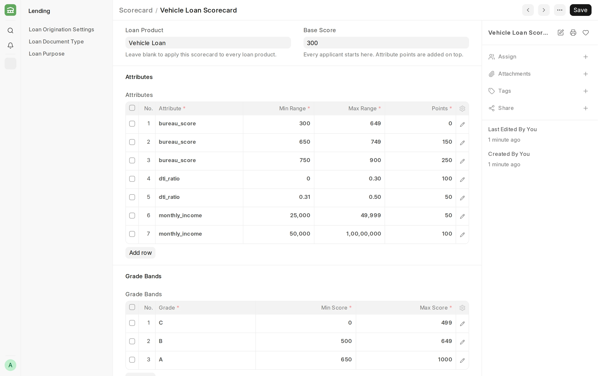

## Scorecard

**A Scorecard gives an applicant points for each value band they fall into, and grades the total. It runs at underwriting, on a [Loan Decision](/lending/loan-decision).**

#### Prerequisites

Before creating a Scorecard, it is advised to have:

- A [Loan Product](/lending/loan-product), if the scorecard is for one product only.
- The System Manager or Loan Manager role.

#### How to create a Scorecard

1. Go to the Scorecard list and click **Add Scorecard**.
2. Enter a **Scorecard Name**, and optionally a **Loan Product** and a **Base Score**.
3. In **Attributes**, add a row for each band: the [variable](/lending/credit-decisioning#variables), its range, and the points it adds.
4. In **Grade Bands**, add a row for each grade and its score range.
5. Save.

The score starts at the **Base Score**, and each matching band adds its points. The grade is the band that contains the total.

#### Things to note

- The scorecard for the applicant's loan product is used. Without one, a scorecard with no product is used.
- The score and grade are recorded on the Loan Decision. They do not change the decision, except that an Approve becomes **Refer** when an attribute cannot be scored.
- Bands on the same attribute cannot overlap or share an end point. Write `600` to `699` and `700` to `800`.

:::caution
Score only numeric variables. A row on `employment_type`, `applicant_type`, or `loan_product` never scores, so it turns every Approve into Refer.
:::

#### Related topics

- [Credit Decisioning](/lending/credit-decisioning)
- [Decision Strategy](/lending/decision-strategy)
- [Loan Decision](/lending/loan-decision)
